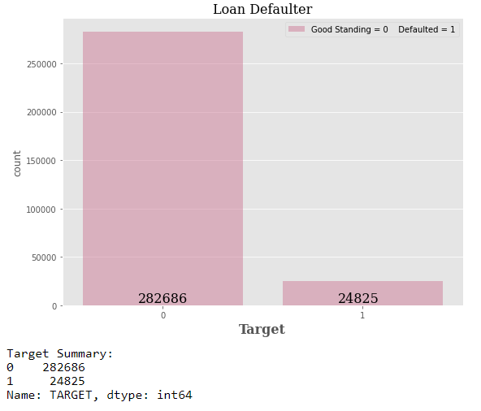
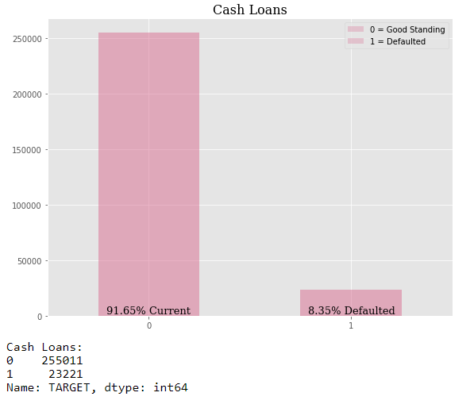
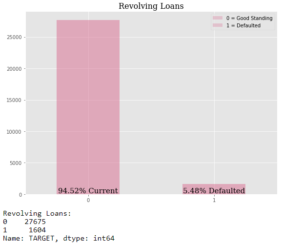
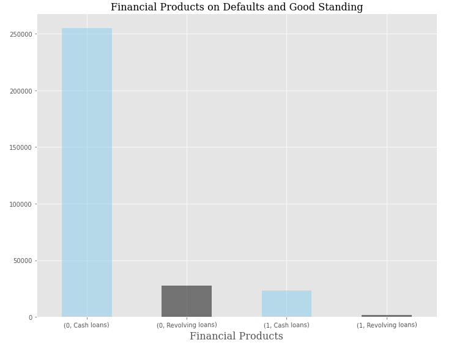
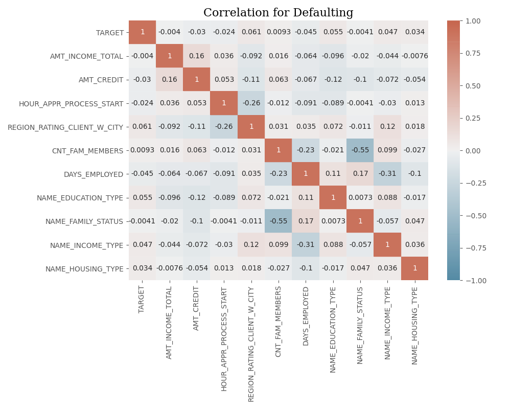
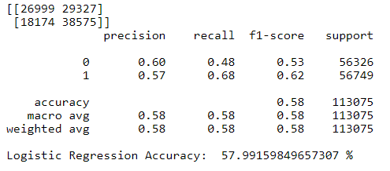
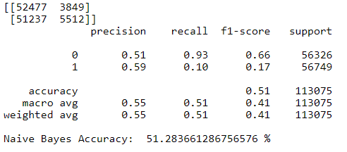
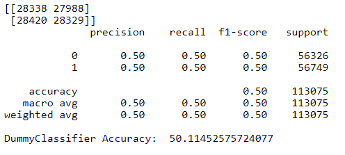

## Loan Defaulter

### Case Study 

When people apply for a loan, the underwriter decides whom is a risky applicant or whom is a safe applicant. However, it is not always clear on the methodology employed by an underwriter. In the present case study, I utilized Kaggle's Loan Defaulter data set to derive some insights into what an underwriter might be deciding on when people apply for a loan. The data set consisted of `307511 rows` `122 columns`. 

## Overview of Financial Products Defaults

Looking at the bar plot, `8.07 %` consumers defaulted on their financial product. 

### Cash Loans 

Cash loans are very popular. A total of 278,232 cash loans products were sold. However, `8.35 %` defaulted on their cash loans. 

### Revolving Loans

Revolving loans aren't as popular as cash loans. There is a total of 29,279. `5.48%` revolving loan consumers defaulted on their loan. 

### Cash Loans vs Revolving Loans

Cash loans are big business. 

### Who Are The Consumers?

Women represent a large share of loans, nearly twice as much as men. 

### Correlation for Defaulting

I used a lot of attributes to correlate with the target attribute, whether someone defaults or not on their loan. The attributes were amount of income, credit amount of the loan, approximation at what hour did the applicant applied for the loan, region where applicant lives, how many family members, days employed, highest level of education of applicant, family status of the applicant, type of occupation, and type of housing (whether applicant rents, owns, etc.). Overall, all attributes had an approximate zero correlation.

### Classification Model

Since the target attribute was severely imbalanced, I had to upsample the minority class to balance the target attribute. I used a Logistic, Gaussian, and Dummy model to test which model performed best. All three models were slightly higher or just as good as flipping a coin when predicting whom defaults based on the attributes listed above. 

### Conclusion

According to the models, using the attributes listed above aren't really good at predicting whom defaults on their loan. Although those attributes have an intuitive gut feeling that someone might default, this data set and models say it is about the same as flipping a coin.

#### [ GitHub Repository [Link](https://github.com/RenaissanceMan06/Loan_Defaulter) ]
